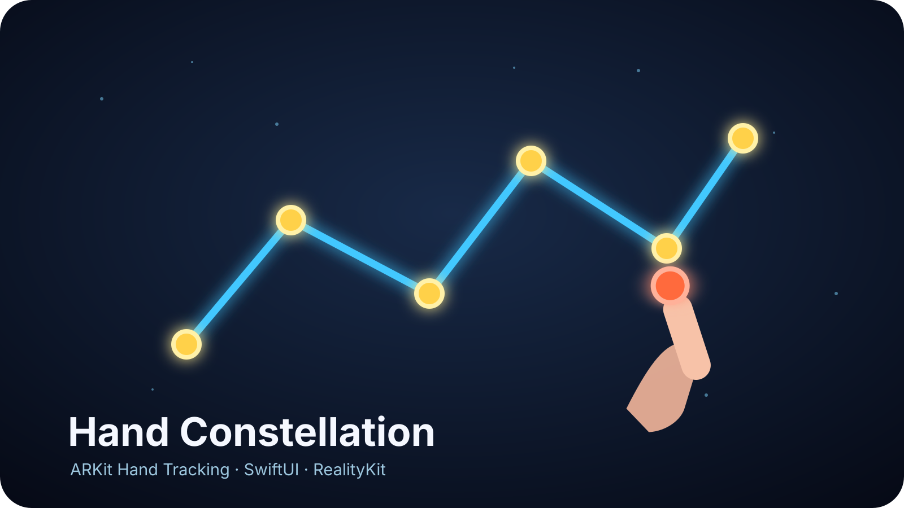

# Hand Constellation

ARKit의 visionOS Hand Tracking으로 오른손 검지 끝을 인식하고, 한 위치에 오래 머물면 공중에 점을 찍은 뒤 다음 점과 선으로 연결하는 SwiftUI 튜토리얼 프로젝트입니다. 점을 세 개 이상 만든 뒤 빛나는 첫 점에서 머물면 중복 점 없이 닫힌 도형을 완성할 수 있습니다.



## 완성 동작

1. **별자리 그리기 시작**을 바라보고 엄지와 검지를 맞대어 몰입형 공간을 엽니다.
2. 공간은 안전하게 **그리기 꺼짐** 상태로 시작합니다. 창의 **그리기 켜기**를 누르거나 오른손 주먹을 약 0.6초 유지합니다.
3. 오른손 검지 끝의 주황색 커서를 원하는 위치에 둡니다.
4. 작은 범위 안에서 약 0.8초 동안 머물면 노란 점이 생깁니다.
5. 손가락을 3cm 이상 옮긴 다음 다시 머물면 새 점과 이전 점 사이에 파란 선이 생깁니다.
6. 점이 세 개 이상이면 첫 점이 청록색으로 강조됩니다. 첫 점으로 돌아가 머물면 미리보기 선이 채워진 뒤 도형이 닫힙니다.
7. 닫을 때는 기존 첫 점을 재사용하므로 삼각형은 점 3개와 선 3개로 완성됩니다.
8. 오른손 주먹을 다시 0.6초 유지하면 그리기가 꺼집니다. 기존 별자리는 유지되고 손을 움직여도 새 점이 생기지 않습니다.
9. 닫은 뒤 또는 그리기를 다시 켠 뒤 만드는 첫 점은 이전 별자리와 연결되지 않고 새 별자리를 시작합니다.
10. **초기화**로 모든 별자리의 점과 선을 지울 수 있습니다.

## 개발 환경

- Xcode 16 이상과 visionOS SDK
- visionOS 2.0 이상을 실행하는 Apple Vision Pro
- SwiftUI, ARKit, RealityKit
- 실제 손 추적과 권한 검증을 위한 실기기

Xcode Settings > Components에서 visionOS 플랫폼과 필요한 Simulator runtime을 먼저 설치하세요.

## 실행하기

1. `HandConstellation.xcodeproj`를 Xcode에서 엽니다.
2. HandConstellation 타깃의 Signing & Capabilities에서 Team을 선택합니다.
3. `com.example.HandConstellation`을 본인의 고유한 Bundle Identifier로 바꿉니다.
4. Apple Vision Pro를 실행 대상으로 선택하고 앱을 Run합니다.
5. 손 추적 권한을 허용한 뒤 몰입형 공간을 엽니다.

손 추적 사용 설명은 `HandConstellation/Info.plist`에 포함되어 있습니다.

## 프로젝트 구조

```text
HandConstellation/
├── HandConstellationApp.swift        SwiftUI Scene 진입점
├── ControlView.swift                 시작·종료·그리기 전환·초기화 창
├── ImmersiveView.swift               RealityView와 추적 task
├── HandTrackingService.swift         권한·ARKitSession·검지 좌표·주먹 판정
├── ConstellationConfiguration.swift  체류·거리·크기 조절 값
├── DwellDetector.swift               체류 상태 머신
├── ClosureDetector.swift             시작점 스냅과 닫기 체류 판정
├── FistHoldDetector.swift            주먹 유지와 1회 전환 판정
├── ConstellationModel.swift          점과 선분 규칙
├── ConstellationRenderer.swift       RealityKit 점·선·커서·닫기 피드백
├── ImmersiveCoordinator.swift        전체 데이터 흐름 연결
└── HandConstellation.docc/           DocC 튜토리얼과 참조 문서
DocumentationTheme/                   확대된 단계·코드 패널용 DocC 렌더 테마
Scripts/                              코드 스냅샷·튜토리얼 이미지 생성과 검증
```

설계 근거와 조사 결과는 [PROJECT_REQUIREMENTS.md](PROJECT_REQUIREMENTS.md), 완성 튜토리얼은 [DocC 카탈로그](HandConstellation/HandConstellation.docc/HandConstellation.md)에서 확인할 수 있습니다.

## 검증하기

호스트 macOS에서 ARKit과 무관한 체류 판정·별자리 모델 테스트를 실행합니다.

```shell
swift test
```

visionOS 앱 타깃을 코드 서명 없이 빌드합니다.

```shell
xcodebuild \
  -project HandConstellation.xcodeproj \
  -scheme HandConstellation \
  -destination 'generic/platform=visionOS' \
  CODE_SIGNING_ALLOWED=NO \
  build
```

로컬 Xcode에 visionOS platform component가 없고 SDK만 있다면 다음처럼 SDK를 직접 지정해 컴파일할 수 있습니다.

```shell
xcodebuild \
  -project HandConstellation.xcodeproj \
  -target HandConstellation \
  -configuration Debug \
  -sdk xros \
  -arch arm64 \
  CODE_SIGNING_ALLOWED=NO \
  build
```

## DocC 문서 빌드

Xcode의 Product > Build Documentation을 사용하거나 명령줄에서 실행합니다.

```shell
xcodebuild \
  -project HandConstellation.xcodeproj \
  -target HandConstellation \
  -configuration Debug \
  -sdk xros \
  -arch arm64 \
  CODE_SIGNING_ALLOWED=NO \
  docbuild
```

튜토리얼은 7개 Chapter와 27개의 짧은 페이지로 나뉩니다. Chapter 1~6은 Xcode의 초기 코드에서 시작해 앱을 완성하고, Chapter 7은 Apple Vision Pro에서 권한 허용, 닫힌 삼각형과 별자리 분리를 확인합니다. 새 파일을 만드는 페이지와 기존 파일을 고치는 페이지가 분리되어 있으며, 각 코드 단계에서 새로 추가된 줄만 강조합니다. 아키텍처, 체류 판정, 시작점 스냅, 문제 해결, GitHub Pages 배포 문서도 함께 포함되어 있습니다.

프로젝트의 `DOCC_TEMPLATE_PATH`가 `DocumentationTheme`을 가리키므로 Xcode와 명령줄 빌드 모두 확대된 단계 카드, 파란 현재 단계 표시, 큰 코드 패널 스타일을 동일하게 적용합니다. 테마의 `js/handconstellation-step-sync.js`는 현재 단계가 바뀔 때 오른쪽 코드 패널만 스크롤해 강조된 줄이 보이도록 맞춥니다. 페이지 자체의 스크롤 위치는 건드리지 않고, 좁은 화면에서는 동작하지 않습니다.

## GitHub Pages 배포

`.github/workflows/documentation.yml`이 `main` 브랜치의 DocC를 정적 사이트로 배포합니다.

1. GitHub 저장소 Settings > Pages에서 Source를 **GitHub Actions**로 선택합니다.
2. 프로젝트를 `main` 브랜치에 push합니다.
3. Actions 탭에서 **Deploy DocC to GitHub Pages**가 완료될 때까지 기다립니다.
4. [배포된 Hand Constellation 튜토리얼](https://82twj.github.io/visionOS_tutorial/documentation/handconstellation/)을 엽니다.

workflow는 저장소 이름을 `DOCC_HOSTING_BASE_PATH`로 자동 설정합니다. 사용자/조직 Pages처럼 도메인 루트에 배포할 때는 이 값을 빈 문자열로 바꾸세요.

## 튜토리얼 자료 다시 만들기

튜토리얼의 코드 스냅샷과 그림은 스크립트로 생성합니다. 앱 소스를 고친 뒤에는 다음을 실행해 스냅샷을 다시 만들고 참조를 검사하세요.

```shell
./Scripts/verify-snapshots.sh
```

각 파일의 마지막 스냅샷은 실제 앱 소스와 바이트 단위로 같아야 하며, 스크립트가 이를 검사합니다. 그림을 다시 만들려면 다음을 실행합니다.

```shell
python3 Scripts/generate_images.py
```

## 현재 검증 범위

- visionOS SDK 대상 앱과 테스트 번들 컴파일 성공
- `swift test`: 27개 테스트 통과
- DocC 아카이브 경고 없이 빌드 성공
- 튜토리얼 코드 스냅샷 142개가 모두 Swift 문법 검사를 통과
- 각 파일의 마지막 스냅샷이 실제 앱 소스와 일치
- 실제 기기 손 추적 동작과 Chapter 7의 캡처는 Apple Vision Pro에서 최종 확인 필요
